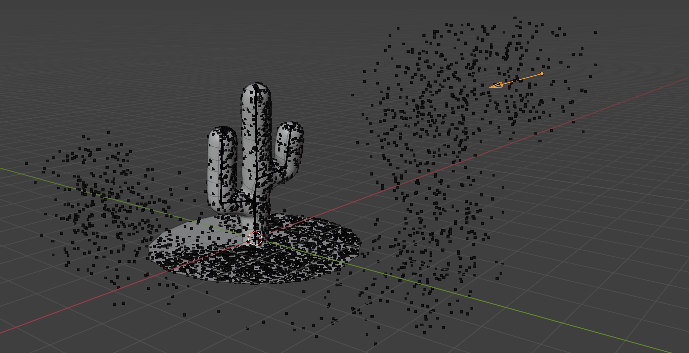

# Particle System A
**Version:** v1.1.3

Elementary particle system for Blender Geometry Nodes, supporting sub-frame integration, fields, mesh collisions, and deterministic behaviour.

---

## Preview

Don't ask why a cactus.

General overview of the node tree. Note: last version may differ.

---

## Main Features
- Sub-frame integration
- Field(s) support (gravity included)
- Euler explicit integration
- Stick to animated mesh colliders
- Basic emission parameters
- Emitter object driven
- Particle deletion
- Scene framerate independent

---

## Changelog

**v1.1.3** - Moved the computation of collided particles outside the Repeat Zone, significantly reducing processing cost and improving overall performance.  
**v1.1.2** – Whole node tree update, same visual behaviour, more accurate maths in documentation  
**unamed** – Initial release

*Note:* Outputs for v1.1.2 are mostly identical to previous versions; simulation behaviour remains compatible.

---

## Usage Notes
- Units: meters / seconds  
- Particle count = particle number × subframe count  
- Subframe count and framerate do not change overall particle behaviour  
- Keyframe interpolations are linear
